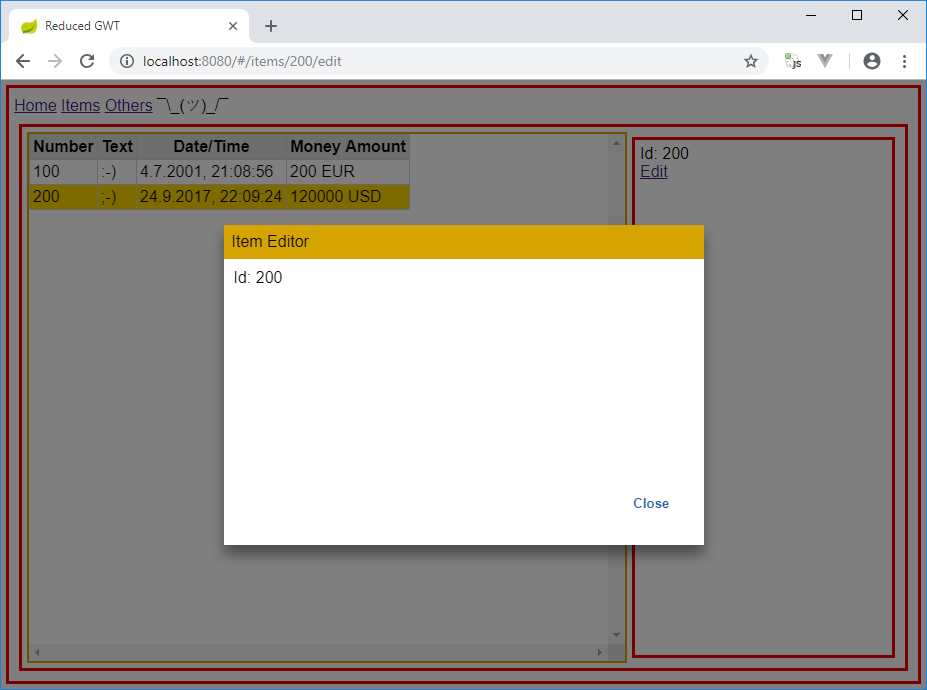

# reduced-gwt

The overall GWT idea is great: Have a single big Java code base.
But things like permutations for different browsers and long compilation cycles (in which the `GWT.create(...)` magic creates up to hundreds of files) make if feel really odd today.

Goal of this project was to throw away as much as possible of that  and use native browser technologies.
For the sample application there isn't even a full `GWT.jar` on the classpath and only a single permutation built.
Result is a build time of 16 seconds for a simple Spring Boot sample application (for GWT that is really, really fast! ;-).

The main enabler for all that is JsInterop introduced in GWT 2.8.
Some other projects were the inspiration of the solutions used in reduced-gwt:

- [gwt-interop-utils](https://github.com/GWTReact/gwt-interop-utils) for usage of native @JsType annotated classes on server and client
- [autorest](https://github.com/intendia-oss/autorest) might be similar to the REST approach used
    - API is [RestyGWT](https://resty-gwt.github.io/) inspired but without GWT generators (needs some maually generated proxies for now)
- [gwt-jsinterop-library](https://github.com/dpreindl/gwt-jsinterop-library) for wrapping the browser's APIs with `@JsType` annotated classes
- [Custom Elements](https://developers.google.com/web/fundamentals/architecture/building-components/customelements) and [ES6 Modules](https://medium.com/dev-channel/es6-modules-in-chrome-canary-m60-ba588dfb8ab7) (works obviously best in Chrome ;-).

## Installation

First [ui-router-core-es6-webjar.zip](ui-router-core-es6-webjar.zip) has to be extracted and installed in the local Maven repository with `mvn clean install` (because [UI-Router Core](https://github.com/ui-router/core) is needed as a ES6 WebJar).

For running the application the following is enough:
```
mvn clean install spring-boot:run
```

The embedded Tomcat of Spring Boot is then reachable via [http://localhost:8080](http://localhost:8080).

## Architecture

[Presenter First of Atomic Object](https://atomicobject.com/resources/presenter-first) inspired MVP pattern is used.
Java code is used for the logic of the presenters.
Whilst the views compose mainly Custom Elements written in JavaScript (for example the grid and the dialog).
The code structure of the presenters and views with the `*UiHandlers` interfaces is derived from [GWTP](https://github.com/ArcBees/GWTP).

The routing is completely done in JavaScript with [UI Router Core](https://github.com/ui-router/core).
UI Router's transition callbacks are dispatched to the GWT presenters lifecycle methods.



RxJava inspired Spring MVC service interfaces are used for allowing usage of the same Java interfacse on server and client side.

REST DTOs are reduced to JSON compatible features to be `@JsInterop` mapped to Java objects.
On the server side Jackson is used for serializing them.

Only the GWT module is included as regular `<script>` tag.
The rest of the JavaScript codebase uses ES6 modules.
For UI Router Core a modified WebJar is included in the repository (see [Installation](#installation)).
JQuery is used in the Custom Element and a Java `Filter` on the server side patches in module `export` statements to allows ES6 usage.